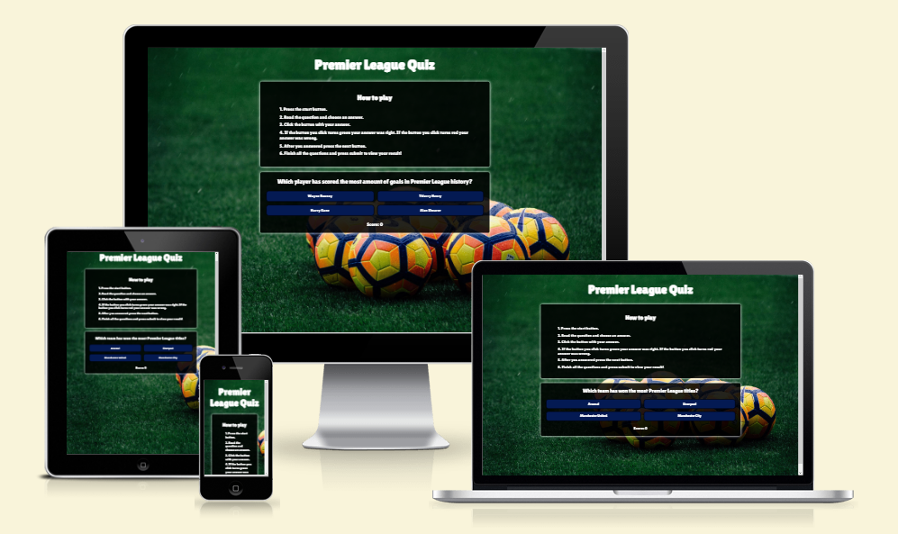
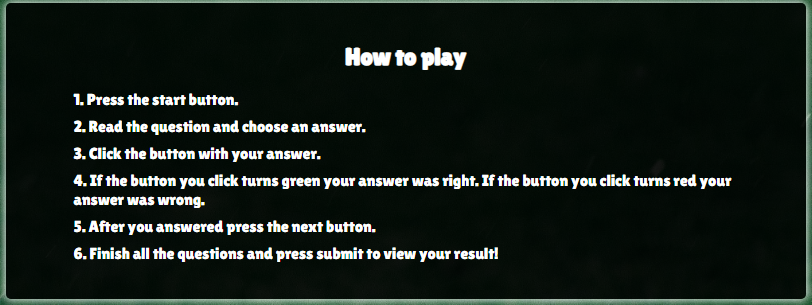
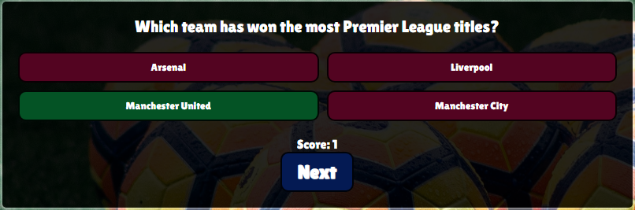
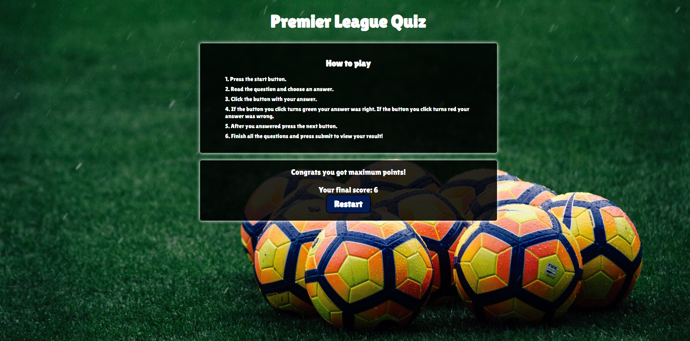
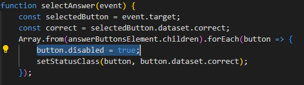
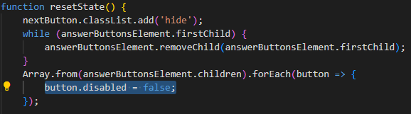
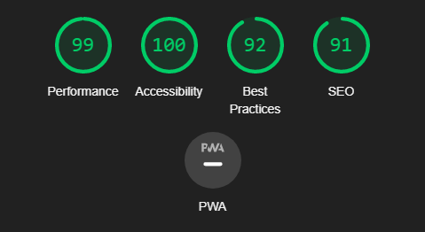

# Premier League Quiz

## Welcome!
[View the live project here](https://samuelkerstell.github.io/project-portfolio-2/)

This website is a fun and engaging platform for football enthusiasts to test their knowledge of the Premier League, offering entertainment and an opportunity to expand their understanding of the league.

# Features

## Existing Features

* ### Header
  * Shows the name of the site
  * When clicked you get back to the home page.
  * The header is valuable for users because it makes it obvious for the user what the site is about.

* ### How to play container
  * Provides clear instructions for easy participation.
  * Enhances the user experience by reducing confusion.
  * Helps new users get started quickly and encourages continued engagement.

* ### Quiz Container
  * An obvious button to start the quiz.
  * The container presents the quiz questions in an interactive format, providing an engaging experience that keeps users entertained and captivated.
  * The quiz container allows users to assess their knowledge of the Premier League, challenging them with a variety of questions related to teams, players, history, and more.

* ### The Quiz Options
  * Green highlights for correct answers and red highlights for incorrect answers provide users with instant feedback.
  * Incorrect answers highlighted in red help users identify and learn from their mistakes.
  * The feature solidifies users understanding of the Premier League by visually reinforcing correct answers and aiding retention of key facts.

* ### The game result
  * Displays the user's final score, providing a clear and concise summary of their performance in the quiz. This allows users to assess their overall knowledge and achievement.
  * Offers feedback based on the user's score. It provides valuable insights for users to enhance their understanding of the Premier League and encourages them to further develop their knowledge.
  * By presenting the final score, it creates a sense of accomplishment for users. It acknowledges their efforts, rewards their participation, and can potentially motivate them to continue engaging with the quiz or share their achievements with others.

* ### Background Image
  * The background image enhances the overall aesthetics of the website, it adds to the overall user experience and makes the website more visually attractive.
  * It helps to reinforce the connection with the subject matter and immerse users in the Premier League atmosphere.

  

## Future Features
 * ### High Score System.
    * Implement a mechanism to track and record users scores as they complete the quiz.
    * Design and display a leaderboard that showcases the highest scores achieved by users.
 
* ### Introduce Difficulty Levels:
   * Categorize questions into difficulty levels such as Easy, Medium, and Hard based on factors like complexity or depth of knowledge required.
   * Assign appropriate difficulty levels to each question in the quiz.

# Testing

## Testing User Stories

| `Goals` | `How Are They Achieved?` |
| ----- | ---------------------- |
| `First time visitors` | |
| Understand what the website is and how to play the quiz. | The How to play container gives the user a good understanding of what the site is about. |
| Expand their knowledge of the Premier League.  | By playing the quiz and learning from their mistakes. |
| Convert into returning visitors.       | By providing an engaging and valuable experience. |
| `Returning Visitors`   |
| To come back and play more quiz. | Provide frequent updates to the quiz content, including new questions, topics, or themed quizzes. |
| `Admin User`           |
| Updating the quiz and difficulty.| Adding more quizzes and introducing different difficulty levels. |

## Full Testing
Full testing was performed on the following devices:
* PC:
  * Desktop PC
* Laptop:
  * Macbook Air 2021 13.6-inch screen
* Mobile Devices:
  * iPhone 13

Desktop PC tested the site using the following browsers:
* Google Chrome
* Opera
* Firefox

The Apple devices tested the site using the following browsers:
* Safari
* Google Chrome

I've confirmed that the site is responsive and looks good on different screen sizes.

| `Feature` | `Expected Outcome` | `Testing Performance` | `Result` | `Pass/Fail`|
| ----------|--------------------|-----------------------|----------|------------|
| `Header`  | |
| Logo               | When clicked the user will be redirected to the Home Page  | Clicked Logo  |  Redirected to the Home Page  | Pass |
|  | | | | |
| `Quiz Container` |  |
| Start Button  | When clicked user will be able to view the first question.  | Clicked on Start button   | First question shows up  | Pass |
| Correct Answer | When clicked user will get instant feedback making the button green     | Clicked on Correct Answer  | Button turns green     | Pass |
| Wrong Answer  | When clicked user will get instant feedback making the button red  | Clicked on Wrong Answer   | Button turns red      | Pass |
| Next Button  | When clicked next question & answers will show up  | Clicked on Next Button   | Next question & answers shows up      | Pass |
| Submit Button  | When clicked your final score will show up  | Clicked on Submit Button   | The final score shows up      | Pass |
| | | | | |
| `Score System` |
| Correct answer | When correct answer is choosen score goes up 1 point | Choosed correct answer | Score goes up 1 point  | Pass |
| Wrong answer | When wrong answer is choosen score stays the same | Choosed wrong answer | Score stays the same  | Pass |
| | | | | |
| `Result Container` |
| Restart Button |When clicked quiz will restart | Clicked Restart Button | Quiz is restarted  | Pass |
| | | | | |

### Bugs
* Score is not updating until the next button is clicked.

#### Solved Bugs
* The site was experiencing horizontal scrolling. I fixed it by using the following code to the body: max-width: 100%;
* The score was adding more than 1 if I pressed the correct answer multiple times. I fixed this by adding the highlighted code:

  

## Validation Testing
* HTML
  * No errors were returned when passing through the official [W3C validator](https://validator.w3.org)
* CSS
  * No errors were found when passing through the official [(Jigsaw) validator](https://jigsaw.w3.org/css-validator/)
* JavaScript
  * No errors were found when passing through the official [(JSHint)](https://jshint.com)
* Accessibility

# Technologies Used

## Frameworks, Libraries & Progams Used
  * Hover:css was used on the buttons to show a transition when hovered over.
  * [Google Fonts](https://fonts.google.com) was used to import the 'Lilita One' font in the style.css file which is used on all text of the website.
  * [Git](https://gitpod.io) was used for version control system to manage code changes, and the Gitpod terminal to commit those changes to Git and push them to GitHub.
  * [GitHub](https://github.com) was used to store the project code after being pushed from gitpod.
  * [compressor.io](https://compressor.io) was used to compress the background image.
  * [ChatGPT](https://chat.openai.com) was used to improve copyright.
 ## Languages Used
 * HTML5
 * CSS3
 * JavaScript

# Deployment
* The site was deployed to GitHub pages. The steps to deploy are as follows:
  * In the GitHub repository, navigate to the Settings tab
  * From the source section drop-down menu, select the Master Branch
  * Once the master branch has been selected, the page will be automatically refreshed with a detailed ribbon display to indicate the successful deployment.
The live link can be found here - [Premier League Quiz](https://samuelkerstell.github.io/project-portfolio-2/)

# Credits
## Code Used
 * Some of the JavaScript functions was inspired from this Youtube video from the user [Web Dev Simplified](https://www.youtube.com/watch?v=riDzcEQbX6k) because I wasn't 100% confident on how to go about this Quiz.

## Media
* The background image was taken from [Unsplash](https://unsplash.com/photos/ObhCU6Vhoe8)